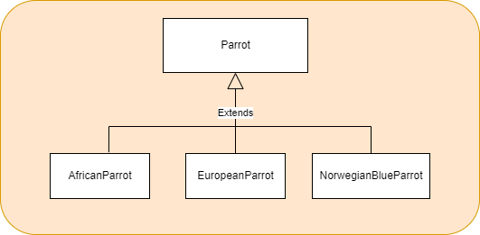

# Parrot Refactoring Kata in Java

This is a fork of Emily Bache's repository, [which can be found here](https://github.com/emilybache/Parrot-Refactoring-Kata).

Can you spot any code smells in this code? I'll give you a clue - a spot of Pol(l)ymorphism should improve matters!

Refactor this code, take small steps, run the tests often. See how small and beautiful you can make it.

## Acknowledgements
This code is heavily inspired by one of the examples in Martin Fowler's book "Refactoring". It's a classic, and if it's not on your bookshelf already I suggest you treat yourself to a copy!

## Instructions
1. Refactor into a polymorphic solution (see diagram below).
2. Take small steps and run the tests often.
3. Use automated refactorings as much as possible.

